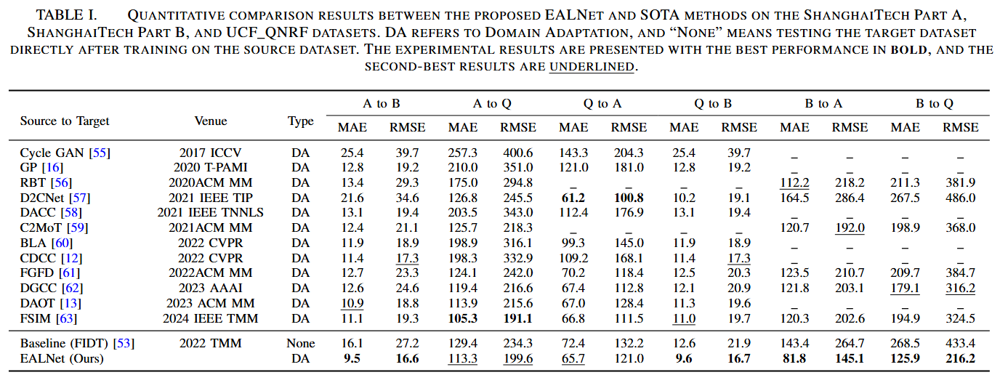
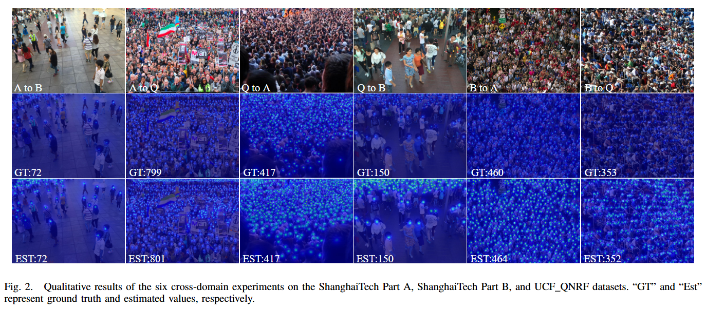
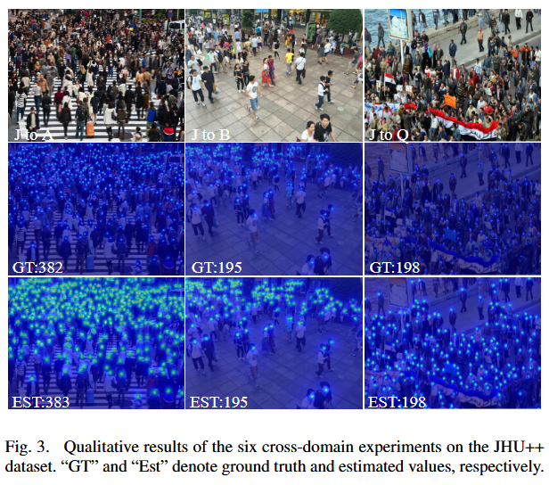
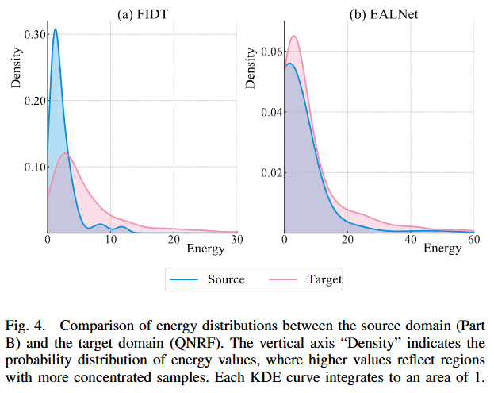

# Energy-driven Active Learning Network for Domain Adaptation in Crowd Counting

This repository contains the code and resources associated with our paper titled "Energy-driven Active Learning Network for Domain Adaptation in Crowd Counting". Please note that the paper is currently under review for publication.

The code is tested on Ubuntu 22.04 environment (Python3.9.20, PyTorch2.2.2) with an NVIDIA GeForce RTX 3090 Ti.

## Contents

- [Energy-driven Active Learning Network for Domain Adaptation in Crowd Counting](#Energy-driven-Active-Learning-Network-for-Domain-Adaptation-in-Crowd-Countingn)
  <!-- - [Contents](#contents) -->
  - [Introduction](#introduction)
  - [Train](#train)
  - [Test](#test)
  - [Pretrained Weights](#pretrained-weights)
  - [Results](#results)
    - [Quantitative Results](#quantitative-results)
    - [Visual Results](#visual-results)
  <!-- - [Citation](#citation) -->
  - [Acknowledgements](#acknowledgements)

## Introduction


<!-- Crowd counting is a critical task in smart city infrastructure and public safety applications. However, current models struggle with cross-domain generalization, particularly when significant domain shifts exist between the source and target data. The high cost of acquiring fully annotated datasets and the suboptimal performance of unsupervised techniques further restrict the scalability of these models. To tackle domain discrepancy challenges, we introduce Energy-driven Active Learning Network (EALNet) for domain adaptation in crowd counting. This method integrates active learning to select informative samples that minimize labeling overhead while maximizing accuracy. It innovatively utilizes the energy gap between source and target domains, alongside test-time augmentation, to identify the most valuable target data subset for annotation. Moreover, cross-domain energy alignment is employed to mitigate distribution mismatches.  -->


## Train
The training code will be released after the acceptance of this paper


## Test

<!-- The training code will be released after the acceptance of this paper -->
1. Prepare the datasets used in the experiment.
2. Modify the data set address in `make_npydata.py` to generate the correct dataset information
3. Modify the dataset, save_path and other options in `config.py`.
4. Modify `test.py` to specify your own test options.
5. update the `pre` argument in `config.py` with the path to the pretrained model.
6. After performing the above modifications, you can start the testing process by running `python test.py`.

## Pretrained Weights

The pretrained weights from [HERE]([https://1drv.ms/f/s!Al2dMJC6HUgQrbYab3ozHGUYrq2itQ?e=i0GN1R](https://1drv.ms/f/c/0abf45936cac74cd/Ej9NpF2NmQ1Ktaq9jC2yGFkB001YcQFqQFNNU-3SRw3wKQ?e=CTRccy)).

## Results

### Quantitative Results




### Visual Results






<!-- ## Citation -->

<!-- If you find this code or research helpful, please consider citing our paper: -->

<!-- ```BibTeX -->
<!-- @article{Cheng2025Energy,
title={Energy-driven Active Learning Network for Domain Adaptation in Crowd Counting},
author={Cheng, Jing-an and Zhai, Wenzhe and Li, Qilei and Gao, Mingliang},
journal={under_review}
year={2025},
}
```
Please note that this citation is a placeholder and will be updated with the actual citation information once the paper is accepted and published. We kindly request you to revisit this section and replace the placeholder with the correct citation detail. -->

## Acknowledgements

This code is built on [FIDTM](https://github.com/dk-liang/FIDTM). We thank the authors for sharing their codes.
